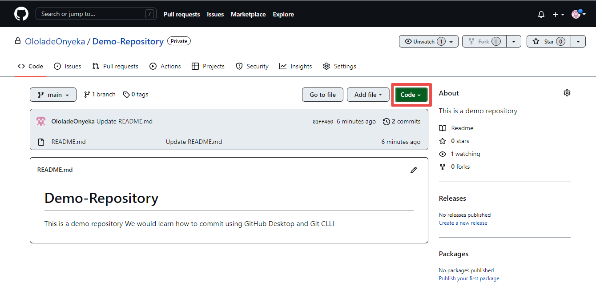

# Introduction To GitHub

## Table of Contents
1. Introduction
2. What is GitHub?
3. Why GitHub?
4. Git vs Github
5. GitHub Desktop vs GitHub CLi
6. Clone
7. Commit
8. Pull
9. Conclusion

## Introduction
We all work on multiple projects on a daily basis as Content Creators, Developers, Designers, Product Managers, Writers, and Engineers, that center on creating folders and files, making changes, communicating with others, exchanging ideas, and so on. Git is a version control tool that was built to allow users track different versions of their projects accross time. GitHub is a project collaboration tool used by both local and distributed teams all over the world.In this resource, you will be introduced to Git, GitHub and a few Git commands.

## What is GitHub?
GitHub is a cloud-based hosting platform for interacting with Git Repositories. It is an excellent resource for developer collaboration, that helps keep track of, share and save Git projects remotely.

## Why GitHub?
GitHub is a fantastic collaborative platform that allows users to work on projects with people from all around the world.It is also an excellent tool for Version Control. Version Control allows developers to keep track of and manage the many versions of their project code.

## Git Vs GitHub

The terms Git and GitHub are frequently used interchangeably. They are, however, not the same, despite their similarities. Some distinctions between Git and GitHub are listed below.

| Git                    | GitHub            |
|------------------------|-------------------|
| Git is installed and managed locally on your computer.              |GitHub is a cloud-based hosting platform that allows you to share your project with others and give them the ability to make changes or adjustments.            |
| Git can be used without an internet connection.       |   GitHub is a cloud-based service that cannot be accessed without an internet connection.
|Git is a free and low-cost version control system. | GitHub is a commercial service (although basic features are available for free to account holders)
|Git can be used without GitHub | GitHub cannot function without Git.

## GitHub Desktop Vs GitHub CLI
GitHub CLI (Command Line Interface) is a command line tool that allows users to execute Git commands and syntax on their computer terminal.

GitHub Desktop is a simple easy-to-use application that allows users to communicate with Git using a Graphic User Interface (GUI) rather than the Command Line Interface or a web browser.

Some Key differences between GitHub Desktop and GitHub CLI are highlighted below:

|GitHub Desktop              |GitHub CLI                   |
|----------------------------| ----------------------------|
GitHub Desktop is Simple to use for beginners.  | GitHub CLI is Complex and has a steep learning curve for beginners.
|GitHub Desktop is entirely cloud-based and cannot be accessed without an internet connection.| GitHub CLI can be used without an internet connection after the initial download and installation.

We're about to get into the technical parts of this article, where you'll learn how to perform three fundamental Git tasks in GitHub and GitHub CLI, namely Commit, Clone, and Pull. However, before we get started, we want to make sure the following are available;

1. A computer.
2. [A GitHub Account](https://github.com/signup?ref_cta=Sign+up&ref_loc=header+logged+out&ref_page=%2F&source=header-home)
3. [A GitHub CLI Installation](https://git-scm.com/downloads)
4. [GitHub Desktop Installation](https://desktop.github.com/)
5. [Visual Studio Code](https://code.visualstudio.com/download).
   You may use any text editor of your choice, but I'd recommend Visual Studio Code for this article.

NB: All images and commands shown in this article are from a Windows Device.

## Clone
Git Clone is used to create a copy of your repository onto your local device.

### Git Clone with GitHub Desktop
1. Sign in to GitHub web browser with your email address or username
2. [Create a new repository](https://docs.github.com/en/get-started/quickstart/create-a-repo). 
3. Copy the HTTPS url link of the Repository you created

.png)
 
4. [Create a folder](https://www.computerhope.com/issues/ch000742.htm) on your local device where the cloned repository will be saved.
   
5. Sign in to GitHub Desktop version.
   .png)
   
6. Click on 'Clone a Repository from the Internet' or click on File > Clone Repository.

.png)

.png)

7. Click on URL > Paste the link of the repository you copied in the URL bar. 
   
   Choose the location path you would like the cloned repository to be saved on your local computer > click Clone.
   
.png)

8. Your repository is now cloning and should take about a few seconds to some minutes depending on file size.
   
.png)

## Git Clone with GitBash
Git Bash is an application that allows you to use the Git command line on your operating system. The commands in Git Bash allow the user to interact with the repository and git elements.

1. Follow steps 1 - 4 above
2. Open the GitBash Terminal
   
.png)

3. Specify the location you want to save the cloned file by using the `cd` command and tap Enter.
4. Type the CLI command  `git clone`, paste the repository URL you copied, and tap Enter.

.png)
5. Your repository is now cloned as shown in the image below

.png)

6. To view the cloned repository on your local device and navigate to the folder you initially specified.

## Commit
Git Commit is used to permanently save changes made to a local repository.

## Git Commit with GitHub Desktop
1. Open GitHub Desktop and navigate to the toggle to select the repository you would like to make changes to.
   
.png)

2. Click on Add to either clone a repository, create a new repository or add an existing repository.
   
.png)
.png)

3. After adding your repository, click'Open In Visual Studio Code'
   
.png)

4. Select 'Yes I trust the authors'. This action will open the Repository in Visual Studio Code.

.png)

5. Navigate to the left panel to interact with the folders and files in your repository. Then proceed to make the changes as required.

.png)

6. After making the required changes, select File > Save, in order to save the changes.

.png)

7. The number of changes made will be indicated at the left panel and the edits in green as shown in the image.
8. To commit the changes made to the repository, navigate to the bottom left of the panel and input the following information

   a. Summary - This is a summary of the commit that was made and is required for the commit function to be enabled.
   
   b. Description - This is a description of the commits that were made, however, not required.

   c. Commit to main - This perfoms the action of  committing the change(s) made to the repository.

.png)

9. The commits are still on the local repository, and to push the commits to the remote repo, click 'Push Origin' and this will push it to the remote repository.
    
.png)

## Git Commit via GitHub CLI

1. Open the Repository on your local computer and make the required changes using Visua Studio Code.

2. Open GitBash on your local computer and navigate to the folder that contains the repository by typing `cd` and the name of the folder, then click Enter.
3. To access the repository, type `cd` + the repository name, and Enter, as shown in the image.
4. To view the modified files in your repository, type `git status` and click Enter.

.png)

5. Type `git add` + the name of the modified file(s) then click Enter. This brings the file to staging.
6. Type `git status` to check that the file(s) has been successfuly added. The added file should be in green and this tells you the file is ready to be commited to the repository.

.png)

7. To commit the file(s), type `git commit -m"commit message" -m"commit message description`

.png)

## Pull
A pull action is used to extract updated content from a remote repository to the local repository. This action ensures the content of the local repository matches the remote repository. This is done in order to propose and work collaboratively on changes to a repository.

### Pull via GitHub Desktop
1. Open GitHub Desktop
2. Click the dropdown arrow to select the Repository you would like to pull.
   
.png)

3. Click on Repository > Pull
   
.png)

4a. This activates the Pull action.

4b. To view the pulled repository, click open in Visual Studio Code

.png)

### Pull via Git CLI
1. Open Git Bash
2. Open the Folder where the Repository you would like to update is located.
3. Copy the URL of the remote repository you intend to pull.
4. Type `git pull` + the url link of the remote repository.
5. Click Enter.

.png)

## Conclusion
Git, GitHub, and GitBash Terminal are all diverse and valuable tools, but getting the most out of them requires constant practice and commitment. Like any other tool, the more you use them, the better you get at them.

